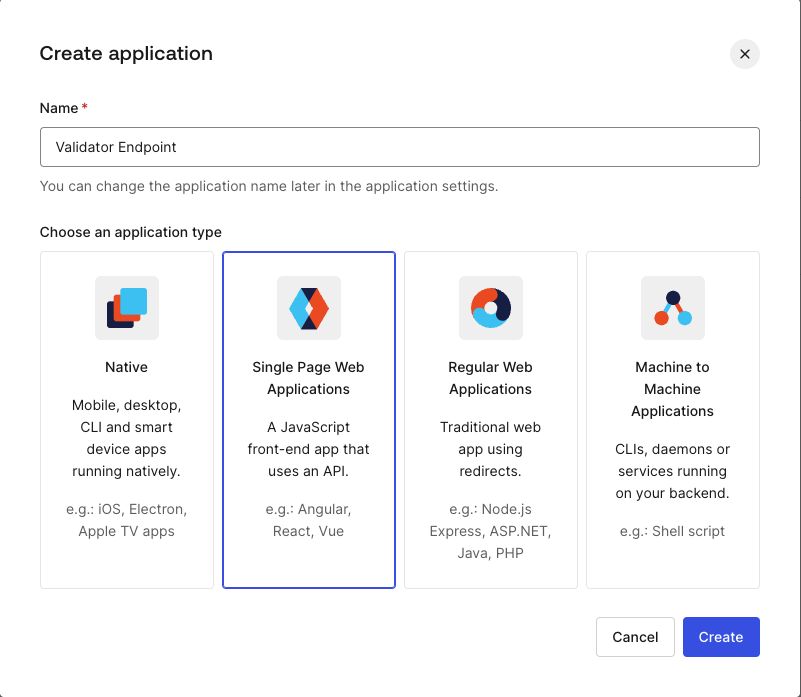
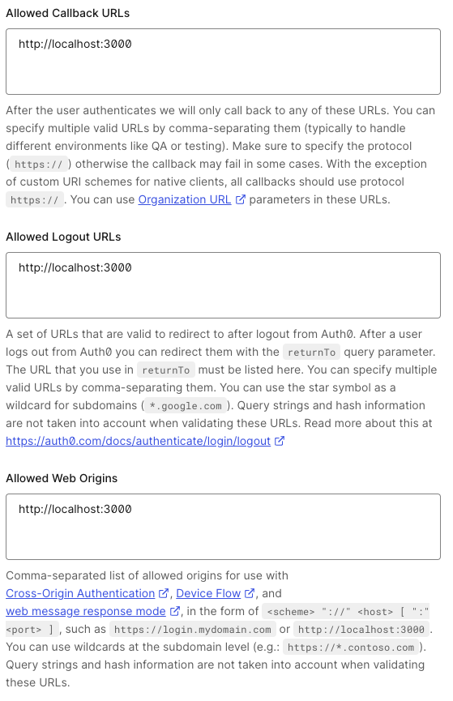
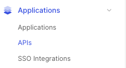
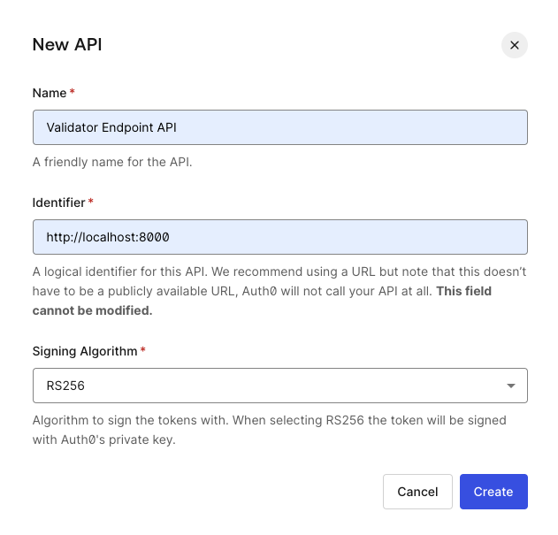
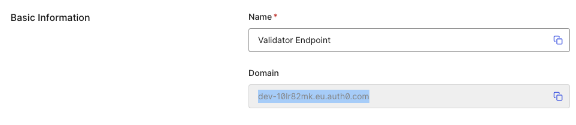
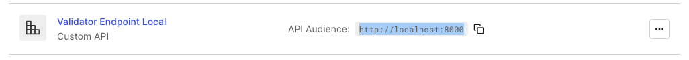

# Getting started with Auth0 and validator-endpoint

To enable login via services such as Github and Google, and simply using username/password signups with `chat-ui` an Auth0 setup is required.

Before continuing create an account at https://auth0.com/signup and visit the dashboard.

## Create and Configure an Application

1. Via the sidebar navgiate to `Applications -> Applications -> Create Application`
2. Give it a name, e.g. "Validator Endpoint", and select `"Single Page Web Applications" -> Click Create`
   
3. Add the frontend url to Allowed Callback URLs, Allowed Logout URLs, and Allowed Web Origins. For a dev enviornment the frontend is hosted on `http://localhost:3000`. For a production environment make sure to update these to domain used. For example `https://chat.fabhed.dev`
   

## Create an API

We've have now created an Application, and now we need to register an API.

1. Via the sidebar navigate to `Applications -> APIs`
   
2. Click `Create API`
3. Fill in the form, give it a name, e.g. "Validator Endpoint API", an Identifier, which can be set to the API URL, for a dev setup, it could be: `http://localhost:8000` (default URL for btvep). Use `RS256` as the Signing Alghorithm.
   

## Configure `btvep`

1. Set `auth0_domain`
   , `auth0_issuer` and `auth0_api_audience` in `btvep/config.json`

`config.json`

```json
{
    ...
    // Example values (You will need to get your values from the auth0 dashboard)
    "auth0_domain": "dev-10lr82mk.eu.auth0.com",
    "auth0_issuer": "https://dev-10lr82mk.eu.auth0.com/",
    "auth0_api_audience": "http://localhost:8000",
    ...
}
```

- `auth0_domain` - Found under the Settings tab of the Application
  
- `auth0_issuer` - Use the auth0_domain but prefix with `https://` and a trailing `/`. See example above.
- `auth0_api_audience` - Found in the list of APIs
  

## Configure `chat-ui`

Update env variables for `chat-ui`. Under the `chat-ui` folder, start by copying `.env.local.example` to `.env.local` if you haven't already. Now update `NEXT_PUBLIC_AUTH0_DOMAIN`, `NEXT_PUBLIC_AUTH0_CLIENT_ID`, `NEXT_PUBLIC_AUTH0_REDIRECT_URI` and `NEXT_PUBLIC_AUTH0_AUDIENCE` to match your auth0 configuration you've completed above.

`.env.local`

```bash
NEXT_PUBLIC_AUTH0_DOMAIN=
NEXT_PUBLIC_AUTH0_CLIENT_ID=
NEXT_PUBLIC_AUTH0_REDIRECT_URI=http://localhost:3000
NEXT_PUBLIC_AUTH0_AUDIENCE=http://localhost:8000
NEXT_PUBLIC_VALIDATOR_ENDPOINT_BASE_URL=http://127.0.0.1:8000

# Uncomment the next line to overwrite the default system prompt
#NEXT_PUBLIC_DEFAULT_SYSTEM_PROMPT=
```

<hr/>

## Enabling social connections, e.g. Github, Google, etc.

1. In Auth0’s Management Dashboard, click Connections and then Social.
2. Flip the switch of the selected social network provider to enable it.
3. Select the applications in which you would like to use this provider.
4. The configuration popup will display. There you can select the desired attributes and permissions that you want to get from the provider. You can also enter your own App/Consumer Keys in this screen.

Click Save.

Read more: https://auth0.com/learn/social-login

## Done! 🥳

You have now connected Auth0 to validator-endpoint. Users will be able to login with password or other social logins you enable. Credential management is handled by Auth0, `btvep` simply saves an identifier for each user.
